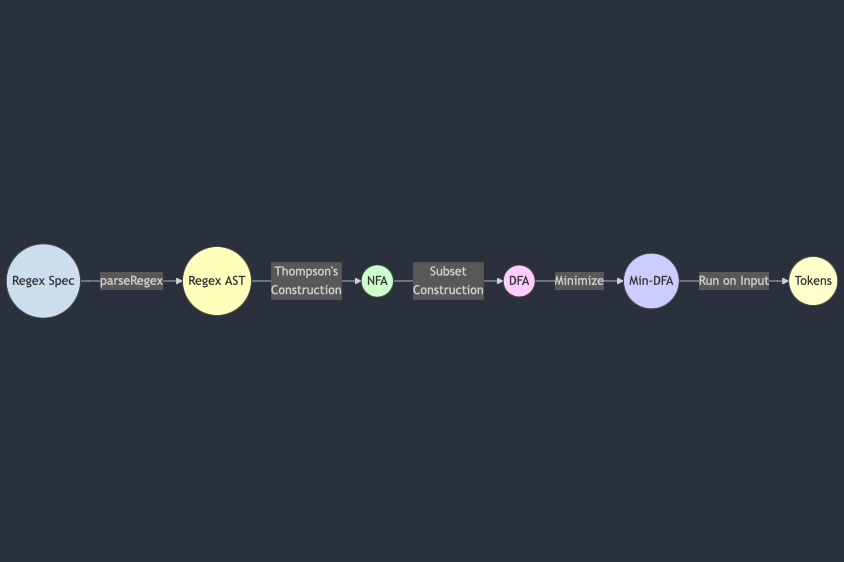

# Python Regex-Based Lexer

This project demonstrates the construction of a basic lexer (tokenizer) in Python using **regular expressions** built via **NFA → DFA → minimized DFA** transformations.



## Overview

- **Lexer.py**  
  Contains the `Lexer` class responsible for splitting a given input string into tokens based on a specification of `(token_name, pattern)` pairs. Internally, each pattern is turned into an AST (abstract syntax tree) via `Regex.py`, transformed into an NFA (using Thompson’s construction), and then converted into a DFA via subset construction (from `NFA.py`), which can be minimized (from `DFA.py`).

- **Regex.py**  
  Defines the classes that represent different parts of a regular expression:
  - `Literal`, `Epsilon`, `Concatenation`, `Alternation`, `KleeneStar`, `Plus`, `Question`, `CharacterClass`.  
  Provides a parser (`parse_regex`) to turn a regex string into its AST, which can then be turned into an NFA.

- **NFA.py**  
  Contains the `NFA` class:
  - Computes epsilon closures.
  - Implements `subset_construction` to generate a DFA from the NFA (the **powerset** construction).

- **DFA.py**  
  Contains the `DFA` class:
  - Simulates the DFA’s acceptance of a string.
  - Offers a `minimize` method for partition-refinement minimization.

## Requirements

- **Python 3.12** (recommended/required)  
  - This code uses `frozenset` for immutable state sets in DFAs, which is fully supported in modern Python versions. Python 3.12 is suggested to ensure all tests run correctly and to avoid any version-specific issues.

## Installation

1. Clone the repository:
   ```bash
   git clone https://github.com/<your-username>/<repo-name>.git
   ```
2. Navigate into the cloned directory:
   ```bash
   cd <repo-name>
   ```
3. *(Optional)* Create and activate a virtual environment:
   ```bash
   python3.12 -m venv venv
   source venv/bin/activate  # On Unix-based systems
   venv\Scripts\activate     # On Windows
   ```
4. Install dependencies (if any). Currently, the code relies only on Python’s standard library.

## Usage

### Defining Your Token Specification

Within `Lexer.py` or your own script, define the token specifications. For instance:

```python
spec = [
    ("NUMBER", "[0-9]+"),
    ("PLUS", "\\+"),
    ("MULT", "\\*"),
    ("LPAREN", "\\("),
    ("RPAREN", "\\)"),
    ("SPACE", "[ \\t\\n]+")
]
```

Each tuple is `(token_name, regex_string)`. You can define as many as needed.

> **Note**: Remember to **escape** backslashes correctly in Python strings.

### Creating and Using the Lexer

```python
from Lexer import Lexer

if __name__ == '__main__':
    # Define token rules
    spec = [
        ("NUMBER", "[0-9]+"),
        ("PLUS", "\\+"),
        ("MULT", "\\*"),
        ("LPAREN", "\\("),
        ("RPAREN", "\\)"),
        ("SPACE", "[ \\t\\n]+")
    ]

    # Instantiate the Lexer
    lexer = Lexer(spec)

    # Lex (tokenize) a test string
    test_string = "12 + 3 * (45 + 6)"
    tokens = lexer.lex(test_string)

    print(tokens)
```

You would see output like:
```
[
  ('NUMBER', '12'),
  ('SPACE', ' '),
  ('PLUS', '+'),
  ('SPACE', ' '),
  ('NUMBER', '3'),
  ('SPACE', ' '),
  ('MULT', '*'),
  ('SPACE', ' '),
  ('LPAREN', '('),
  ('NUMBER', '45'),
  ('SPACE', ' '),
  ('PLUS', '+'),
  ('SPACE', ' '),
  ('NUMBER', '6'),
  ('RPAREN', ')')
]
```

### Error Handling

If the lexer cannot match a portion of the string to any of the specified token patterns, it will return `"Error"` (or your custom error handling). You can handle or propagate this as you see fit.

## Running the Tests

Unit tests (using Python’s built-in `unittest`) are provided. To run them:

1. Navigate to the **src** folder (or wherever your source/test files reside).
2. Use:
   ```bash
   python3.12 -m unittest
   ```
   This will discover and run all tests in the `src` folder that follow the standard naming conventions.

The test file includes multiple test cases to verify tokenization for various regexes and inputs, as well as error handling (for characters that cannot be matched).

## How It Works Internally

1. **Parsing the Regex**: `Regex.py` contains code to parse your token pattern into an abstract syntax tree (AST).
2. **NFA Construction**: The AST is converted into an NFA using Thompson’s construction.
3. **DFA Construction**: The NFA is converted into a DFA using the subset construction (powerset).
4. **Longest Token Match**: The lexer tries each token pattern on the current input and selects the **longest valid match** (often referred to as max-munch).
5. **Token Splitting**: The input is partitioned into `(TOKEN_NAME, LEXEME)` pairs until the entire string is tokenized or an error occurs.

## Contributing

1. Fork the project.
2. Create a new feature branch: `git checkout -b feature/my-feature`.
3. Commit your changes: `git commit -m "Add my feature"`.
4. Push to the branch: `git push origin feature/my-feature`.
5. Open a Pull Request.
